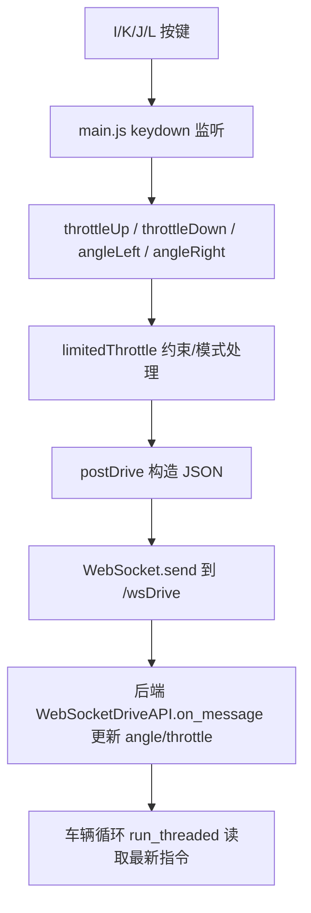

## IKJL 键盘控制逻辑解析

### 1. 按键核心功能
- **I 键**：油门+（每次 +0.05，受油门限幅/模式影响）。
- **K 键**：油门−（每次 −0.05，受油门限幅/模式影响）。
- **J 键**：向左转向（每次 −0.1，夹紧到 −1）。
- **L 键**：向右转向（每次 +0.1，夹紧到 +1）。
- 键盘事件由 `$(document).keydown)` 捕获并调用对应函数，随后通过 WebSocket 将状态回写服务器。

```124:135:donkeycar/parts/web_controller/templates/static/main.js
      $(document).keydown(function(e) {
          if(e.which == 32) { toggleBrake() }  // 'space'  brake
          if(e.which == 82) { toggleRecording() }  // 'r'  toggle recording
          if(e.which == 73) { throttleUp() }  // 'i'  throttle up
          if(e.which == 75) { throttleDown() } // 'k'  slow down
          if(e.which == 74) { angleLeft() } // 'j' turn left
          if(e.which == 76) { angleRight() } // 'l' turn right
          if(e.which == 65) { updateDriveMode('local') } // 'a' turn on local mode (full _A_uto)
          if(e.which == 85) { updateDriveMode('user') } // 'u' turn on manual mode (_U_user)
          if(e.which == 83) { updateDriveMode('local_angle') } // 's' turn on local mode (auto _S_teering)
          if(e.which == 77) { toggleDriveMode() } // 'm' toggle drive mode (_M_ode)
      });
```

### 2. 执行流程（逐步）


### 3. 关键算法 / 处理逻辑
- **增量更新与夹紧**：
  - `throttleUp` / `throttleDown` 每次以 0.05 步长调整 `state.tele.user.throttle`，再经过 `limitedThrottle` 受最大油门与模式控制。
  - `angleLeft` / `angleRight` 以 0.1 步长调整角度，并在 −1…1 夹紧。

```473:491:donkeycar/parts/web_controller/templates/static/main.js
    var throttleUp = function(){
      state.tele.user.throttle = limitedThrottle(Math.min(state.tele.user.throttle + .05, 1));
      postDrive()
    };

    var throttleDown = function(){
      state.tele.user.throttle = limitedThrottle(Math.max(state.tele.user.throttle - .05, -1));
      postDrive()
    };

    var angleLeft = function(){
      state.tele.user.angle = Math.max(state.tele.user.angle - .1, -1)
      postDrive()
    };

    var angleRight = function(){
      state.tele.user.angle = Math.min(state.tele.user.angle + .1, 1)
      postDrive()
    };
```

- **油门限幅与模式**：正向油门被 `maxThrottle` 上限裁剪，反向油门被对称下限裁剪；若油门模式为 `constant`，直接使用 `maxThrottle` 作为固定值。
```549:565:donkeycar/parts/web_controller/templates/static/main.js
    var limitedThrottle = function(newThrottle){
      var limitedThrottle = 0;

      if (newThrottle > 0) {
        limitedThrottle = Math.min(state.maxThrottle, newThrottle);
      }

      if (newThrottle < 0) {
        limitedThrottle = Math.max((state.maxThrottle * -1), newThrottle);
      }

      if (state.throttleMode == 'constant') {
        limitedThrottle = state.maxThrottle;
      }

      return limitedThrottle;
    }
```

- **回传与 UI 同步**：`postDrive` 将 angle/throttle 等字段打包为 JSON，通过已建立的 WebSocket 发送，同时调用 `updateUI` 让进度条/按钮即时反映状态。
```328:351:donkeycar/parts/web_controller/templates/static/main.js
    var postDrive = function(fields=[]){
        if(fields.length === 0) {
            fields = ALL_POST_FIELDS;
        }

        let data = {}
        fields.forEach(field => {
            switch (field) {
                case 'angle': data['angle'] = state.tele.user.angle; break;
                case 'throttle': data['throttle'] = state.tele.user.throttle; break;
                case 'drive_mode': data['drive_mode'] = state.driveMode; break;
                case 'recording': data['recording'] = state.recording; break;
                case 'buttons': data['buttons'] = state.buttons; break;
                default: console.log(`Unexpected post field: '${field}'`); break;
            }
        });
        if(data) {
            let json_data = JSON.stringify(data);
            console.log(`Posting ${json_data}`);
            socket.send(json_data)
            updateUI()
        }
    };
```

- **后端处理**：WebSocket 服务器接收消息后，更新全局应用状态的角度与油门，并可锁存模式/录制状态，供主循环 `run_threaded` 读取。
```293:305:donkeycar/parts/web_controller/web.py
    def on_message(self, message):
        data = json.loads(message)
        self.application.angle = data.get('angle', self.application.angle)
        self.application.throttle = data.get('throttle', self.application.throttle)
        if data.get('drive_mode') is not None:
            self.application.mode = data['drive_mode']
            self.application.mode_latch = self.application.mode
        if data.get('recording') is not None:
            self.application.recording = data['recording']
            self.application.recording_latch = self.application.recording
        if data.get('buttons') is not None:
            latch_buttons(self.application.buttons, data['buttons'])
```

### 4. 输入与输出参数
- **输入**：
  - 键盘按键 I/K/J/L，触发增量更新；依赖已加载的 `main.js` 和已建立的 `ws://<host>/wsDrive` 连接。
  - 用户可通过 UI 选择 `maxThrottle`（默认 1.0）和 `throttleMode`（`user` 或 `constant`）。
- **输出**：
  - 发送到服务器的 JSON 载荷（示例，I 键一次触发后的形态）：
```json
{"angle":0.0,"throttle":0.05,"drive_mode":"user","recording":false,"buttons":{"w1":false,"w2":false,"w3":false,"w4":false,"w5":false}}
```
  - 后端将 `angle`/`throttle` 写入应用状态；在车辆主循环中作为下一周期的控制指令。

### 5. 使用场景与限制条件
- **适用场景**：
  - 无物理手柄/摇杆时的手动驾驶调试。
  - 需要细粒度线性递增/递减油门或微调转向时。
  - 教学/演示键盘控制与 WebSocket 数据路径。
- **限制与注意**：
  - 需成功建立 WebSocket 连接；断开时按键不会生效。
  - 油门受 `maxThrottle` 与 `throttleMode` 约束；在 `constant` 模式下，I/K 仍触发发送，但油门值被固定为设定上限。
  - 角度/油门硬夹紧在 [-1, 1]；过快连按以 0.05/0.1 步进累积。
  - 若已触发 `brake()`，会将油门/角度清零并恢复 `user` 模式；需再次通过按键/按钮解除。
